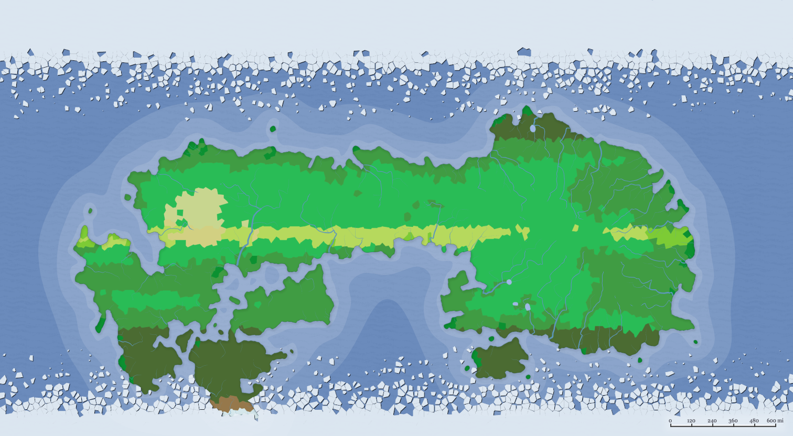
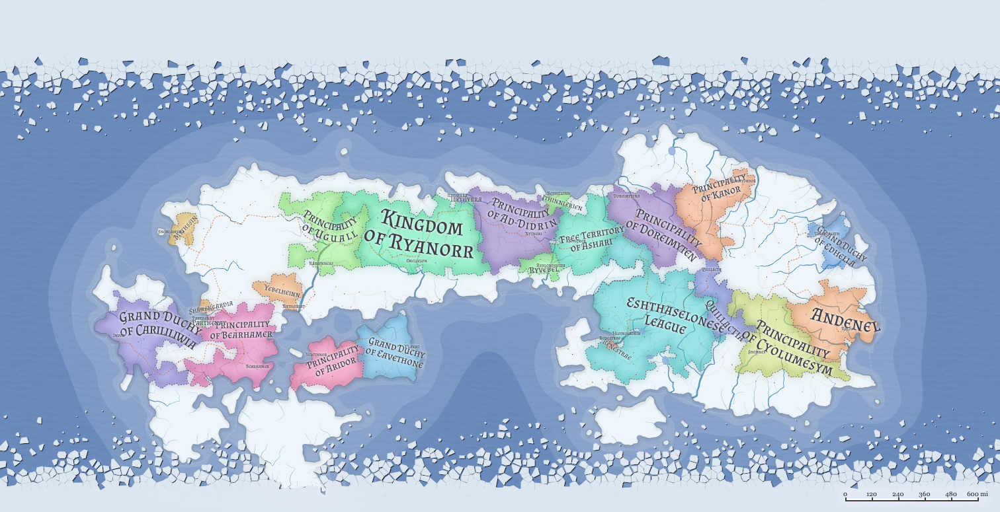

Arborisle is a world of endless forests.

### Races of Arborisle
- Elf, especially Wood Elves
- Firbolg
- Halfling
- Owlin
- Satyr
- Shifter

### Low City Districts
- [Renestrae], an enclave within the [Eshthaselonese League] on the eastern shore of the [Southern Sea].
- [Ilythyrra], between the [Kingdom of Ryanorra] and the [Principality of Ad-Didrin], on the shores of the [North Sea].
- [Parthenay], between the [Principality of Bearhameria] and the [Grand Duchy of Carililiwia], at the end of the [Gulf of Earthill].
NOTE: Whereas Renestrae and Ilythyrra are predominantly Elven, Parthenary is predominantly NOT Elven.

Previous world: n/a

Next world: [[Profugae]]
