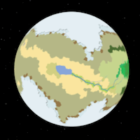
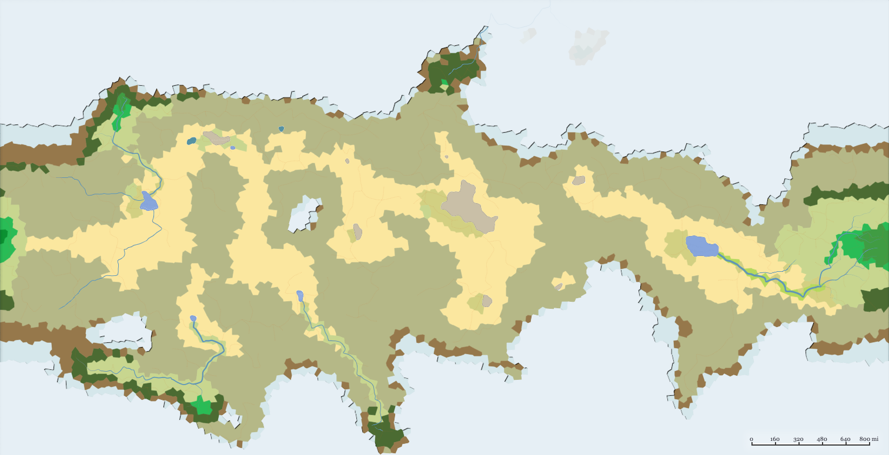
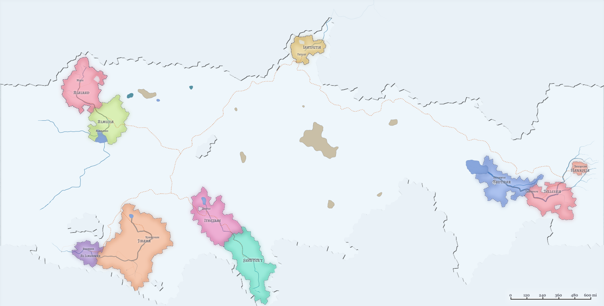

Khashayar is a world of endless deserts, where water is more valuable than gold, and where ~~the spice must flow~~ civilization is mostly restricted to the river banks..

Biomes:

Political Map:

Colonization of Khashayar began in 325 AF

### Races of Khashayar
- Human
- Leonin
- Kalashtar
- Yuan-ti

### Low City Districts
- [Dhiashrir]
- [Ghonumi]

Previous world: [[Emerraine]]

Next world: [[Qigang]]