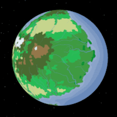
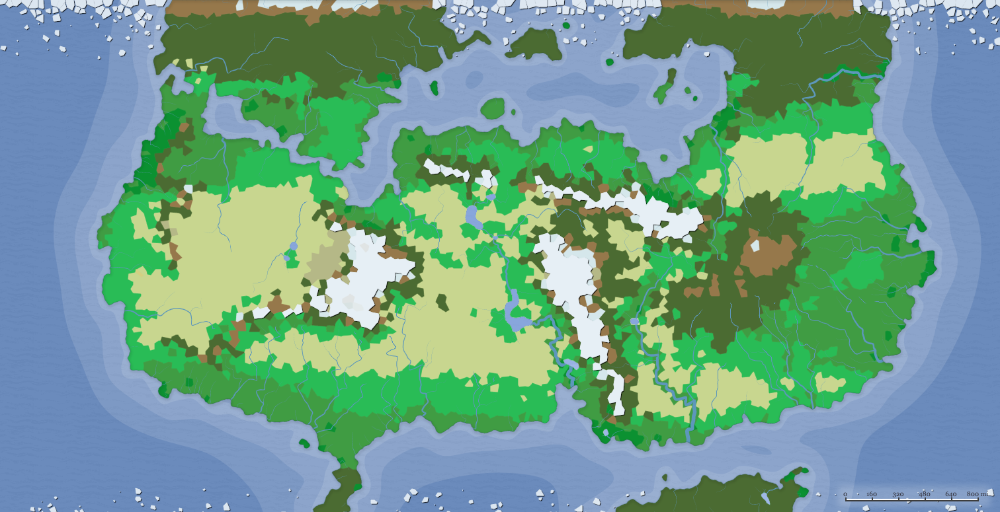

Langsevain is a world of technology... Steam technology. Artificers have taken over this particular asylum, and the trains are never on time.

Biomes:

TODO: political map

Colonization of Langsevain began in 220 AF

### Races of Langsevain
- Dwarf
- Gnome
- Autognome
- Human
- Warforged (but called **[[Forged of Steam and Steel|Steamborn]]**)

### Low City Districts
- [Khudealine]
- [Vezgaxur]

Previous world: [[Shubae]]

Next world: [[Nevermelt]]