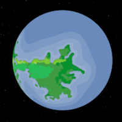

Mortuus Rex is a world under siege. The forces of darkness (mostly) won a thousand years ago, and the last bastion of the light clings to a precarious survival.

Biomes:

Political Map:

Colonization of Mortuus Rex began in 465 AF

### Races of Mortuus Rex
- Aasimar
- Elf, especially High Elves
- Half-elf
- Half-orc
- Human
- Orc
- Tiefling

### Low City Districts
- Nuzairzad

Previous world: [[Strafmack]]

Next world: [[Myrrhina]]