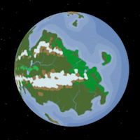
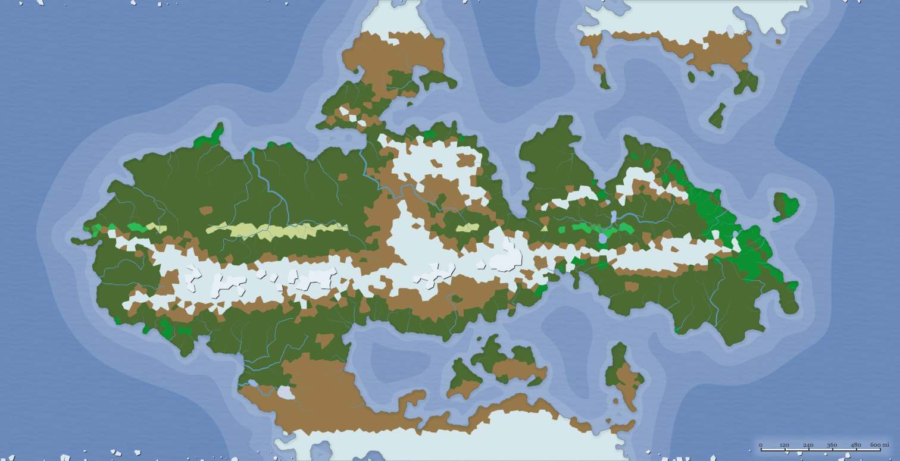

Nevermelt is a world of endless ice and tundra. Only near the equator is farming (and therefore, civilization) possible.

Biomes:

TODO: political map

Colonization of Nevermelt began in 255 AF

### Races of Nevermelt
- Bugbear
- Dwarf
- Goliath
- Hobgoblin

### Low City Districts
- [Jorkarith]
- [Hallgerd]

Previous world: [[Langsevain]]

Next world: [[Emerraine]]