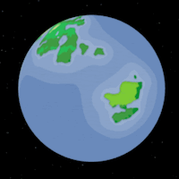
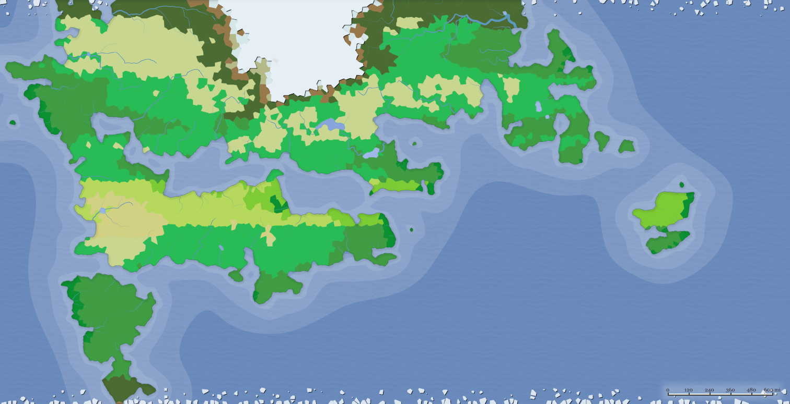

Qigang is a world of ancient kingdoms, where ones honor is worth more than ones life.

Biomes:

TODO: political map

Colonization of Qigang began in 395 AF

### Races of Qigang
- Human
- Leonin
- Loxodon
- Tabaxi

### Low City Districts
- [Daewynn]
- [Tarbent]

Previous world: [[Khashayar]]

Next world: [[Strafmack]]