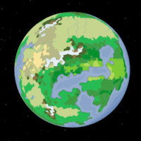
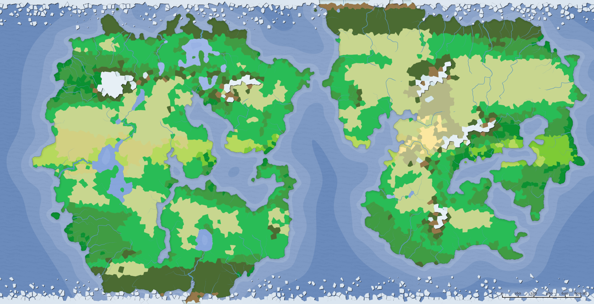

Tertara is a world of magic, ruled by mages, and some would say, built by mages.

Biomes:

TODO: political map

Colonization of Tertara began in 150 AF

### Races of Tertara
- Dragonborn
- Human
- Kobold

### Low City Districts
- [Ragnfast]
- [Novorzhev]
- [Peniculus]

Previous world: [[Profugae]]

Next world: [[Shubae]]